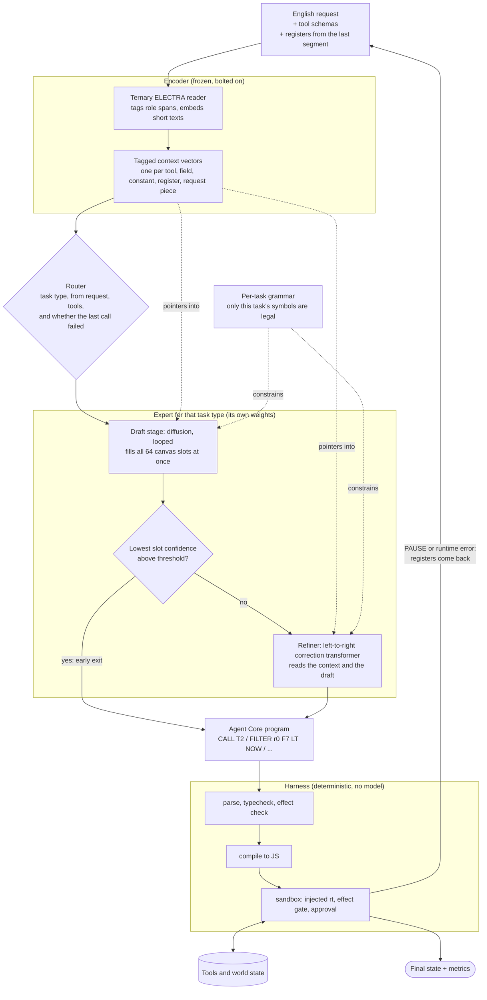

# Covenant Agent

**A tiny model that turns an English request into a tool-calling program, fast enough to run on a laptop NPU.**

Today's agents ask a frontier LLM, one token at a time, what to do next, and pay
a network round-trip for every step. Covenant Agent bets on a different shape:
a few-million-parameter model reads the request and the available tools **once**,
writes the **whole plan as a short program** in one pass, and a deterministic
compiler and sandbox run it. The model never sees the data, never loops through
tool results, and never has to be a general-purpose chatbot. It only has to be
very good at one thing: choosing the right tools and wiring them together.

The raison d'être is **latency and locality**: tool invocation in milliseconds,
on-device, with no API call and no data leaving the machine. This repo is both the
research bench for that bet (the measurement harness, the corpus generator, the
write-ups in [results/](results/)) and the demo that proves it end to end.

> **Where it stands.** The harness, IR, compiler, sandbox, corpus generator and the
> browser demos are built and measured. The staged decoder and the new encoder are
> mid-experiment ([R27](results/R27.md), [R28](results/R28.md)). The NPU runtime is
> plumbing and kernel benchmarks, not yet a running model. See
> [Where each piece stands](#where-each-piece-stands).

## The novel pieces

| | idea | one line |
|---|---|---|
| 1 | [**A program, not a token stream**](#1-the-ir-agent-core) | the model emits Agent Core, a 16-register IR that compiles deterministically to JS |
| 2 | [**Diffusion decoder**](#2-a-diffusion-decoder-with-a-correction-transformer) | the whole program is drafted in parallel on a fixed canvas, not left to right |
| 3 | [**Correction transformer**](#2-a-diffusion-decoder-with-a-correction-transformer) | a left-to-right refiner fixes the draft, and is skipped when the draft is confident |
| 4 | [**Bolted-on encoder**](#3-a-bolted-on-encoder) | a frozen pretrained ternary reader turns text into vectors; the planner only points at them |
| 5 | [**Per-task experts**](#4-experts-and-a-router) | a router picks a small decoder per task type; new types bolt on without retraining old ones |
| 6 | [**Built for the NPU**](#5-built-for-the-npu) | each stage fits in on-chip memory and loops there, so speed comes from compute, not memory bandwidth |
| 7 | [**Code generation, not tool-call JSON**](#6-code-generation-and-the-harness) | the program is compiled to JS, type-checked and effect-checked before it runs |
| 8 | [**Execution in the browser**](#7-execution-in-the-browser) | the compiled JS needs only an injected `rt`, so it runs in a worker with no ambient authority |

## Architecture



The encoder runs once per program. The draft stage loops on weights that stay
loaded. A program gets one trip through the stages, and only a `PAUSE` or a
runtime error sends control back to the top with the registers bound so far.

## 1. The IR: Agent Core

[`spec/agent_core.md`](spec/agent_core.md). A small, register-based language the
model writes instead of prose or JSON:

```
CALL T4 -> r0                 # list cards
FILTER r0 F7 LT NOW -> r1     # overdue ones
FOREACH r1 -> r2
  CALL T6 r2 -> r3            # archive each
  CALL T9 C1 C3               # message Bob
STOP
```

Why a language rather than a function-calling format:

- **Tools, fields and constants are per-request symbols** (`T0`, `F3`, `C1`). The
  model never spells a name or a value; it points at something declared in this
  task. That is what lets it work on tool schemas it never saw in training, and
  it makes an undeclared symbol *unproducible* rather than merely unlikely.
- **Control flow is in the program**: `FILTER`, `FOREACH`, `IF/ELSE`, `PARALLEL`,
  `TRY/RETRY`. One model pass plans a loop over fifty records; there is no
  per-record round-trip.
- **Declining is a first-class output**: `ABORT NOT_FOUND | AMBIGUOUS |
  UNSUPPORTED | NEEDS_INFO`, with the symbols it was confused about.
- **`PAUSE` is the boundary**: when the next step depends on data the program
  hasn't seen yet, it stops, hands its registers back, and the planner writes a
  continuation. This is how it handles observe-then-act tasks (a dungeon, a
  warehouse robot) without ever putting the data in the model's context.
- Programs are short (about 30 tokens at the median) over a vocabulary of a few
  hundred symbols, which is what makes the next piece possible.

## 2. A diffusion decoder with a correction transformer

[`models/tiny/`](models/tiny/README.md), [R8](results/R8.md), [R28](results/R28.md).

A normal LLM writes one token per forward pass. A program here fits on a
**64-slot canvas** (9 slots at the median, 35 at the 95th percentile), so the
decoder predicts **every slot at once**, starting from a blank canvas. Each slot
holds either a keyword (`CALL`, `FILTER`, ...) or a *pointer* at one of this
task's tools, fields, constants or registers.

Two stages, each with the decode order it measured best at:

- **Draft (diffusion, looped).** One small block applied many times to its own
  output, with the same weights. In [R8](results/R8.md), one layer looped 16
  times beat an unlooped block with 8x the parameters, and diffusion transferred
  best to a world it had never trained on.
- **Correction transformer (left-to-right, not looped).** Reads the context and
  the whole draft, with each slot's confidence, and rewrites it one slot at a
  time. Left-to-right decoding was best on worlds it trained on, and looping hurt
  it, so it doesn't loop.

**Early exit.** Every slot carries a confidence. If the lowest one clears a
calibrated threshold, the refiner is skipped. Most programs need one or two
draft rounds; only compound filters need many. On the NPU, skipping a stage
means skipping a weight load.

Honest status: in [R28](results/R28.md) the refiner mostly copied the draft, so
the staged decoder did not beat a plain left-to-right one on accuracy. It is
about 3x faster in steps, and the working goal is to keep closing the accuracy
gap rather than to win outright. Cross-fit drafts (so the refiner sees the
draft's *real* mistakes) are the next experiment.

## 3. A bolted-on encoder

[`.claude/plans/electra-only-reader.md`](.claude/plans/electra-only-reader.md),
[R26](results/R26.md).

The planner doesn't learn English. A **frozen, pretrained reader** does:

- a **ternary ELECTRA-small** (weights are only -1, 0, +1) that does two jobs:
  - a **tag pass** over the whole request marks which words fill which role
    (action, object, destination, source, condition, time, amount);
  - an **embed pass** turns a short text (a role's words, a constant, a field, a
    tool description) into one vector, trained to match a larger sentence model.
- the output is a bag of **tagged context vectors**: one per tool, field,
  constant, register and request piece.

The planner reads those and *points at them*. The decoder has no output rows for
particular tools; its scores are dot products against this task's own vectors.
That is why the encoder is frozen and swappable: it is bolted onto a decoder
that only cares about the vector interface. It is frozen so that experts trained
on top of it don't move underneath each other.

## 4. Experts and a router

[`.claude/plans/staged-decoder-experts.md`](.claude/plans/staged-decoder-experts.md).

Adding task kinds to one shared decoder cost 3 to 12 points on the old ones
([R24](results/R24.md)). The plan: a small **router** picks a task type once per
request (observe-act games, page navigation, data queries, ...), and that type's
**expert** (its own draft stage, and optionally its own refiner) writes the
program. A new task type means training one new expert and retraining the
router; the old experts never change. On the NPU, total capacity grows with the
number of experts while each request loads only one.

Status: planned and partly tested. Step 0 (can a router tell the types apart,
and is there interference to fix) comes before any expert is trained.

## 5. Built for the NPU

[`.claude/plans/npu-native-planner.md`](.claude/plans/npu-native-planner.md),
[`models/npu/`](models/npu/README.md).

The target is the XDNA2 NPU in AMD Strix Point / Halo laptops. It streams
weights from memory at only 25 to 46 GB/s, so any model that re-reads its weights
per token is bandwidth-bound no matter how good the kernels are. The design
inverts that:

- **Each stage's weights fit on chip**: about 4 MB, which is about 16M ternary
  parameters.
- **Loop instead of stream.** Reapplying a resident block costs compute, not
  bandwidth. Looping a block 16 times is nearly free in loads and is where the
  intelligence is bought.
- **One program, one trip.** Few dispatches, because each costs about 0.13 ms.
  Early exit and per-request experts both exist to save a weight load.
- **Ternary and 8-bit activations** so the loop body is small enough to stay
  resident.

Honest status: `models/npu/` is the driver plumbing and a dispatch benchmark. The
model has been trained and measured on GPUs and pods; **no model runs on the NPU
yet**. The throughput figures in the plan are our own kernels, treated as a
floor on the hardware.

## 6. Code generation and the harness

[`core/`](core/), [`harness/`](harness/), [`runtime/`](runtime/).

The model's output is text; everything after it is deterministic and contains no
model:

1. **Grammar-constrained generation.** `harness/task_grammar.py` builds a grammar
   per task from the symbols that task declares, so the planner can only emit
   legal programs over legal symbols.
2. **Parse → typecheck → effect check.** `core/` checks registers, field types
   and operand types, and reports structured diagnostics (a missing argument, a
   wrong type) rather than failing silently.
3. **Compile to JS.** The same AST always produces byte-identical JavaScript.
   `PARALLEL` becomes `Promise.all`, `TRY/RETRY` a catch loop, `PAUSE` a return.
4. **Run in the sandbox.** `runtime/sandbox.js` runs the JS with only an injected
   `rt` object: no DOM, network, storage or globals. Every tool call goes through
   `rt.call`.
5. **Effect gate.** Tools declare `mutates`, `irreversible` or `external`. An
   `irreversible` call runs only with an approval token. The demo runs the whole
   program unapproved first and previews every write, delete and send before
   asking for a click.
6. **Reactive loop.** On a `PAUSE` or a runtime error the sandbox returns the
   registers and the failing line, and the planner writes a continuation.

The harness is also the **only source of truth for accuracy**. A task is a
self-contained JSON row (tools, initial world state, expected final state,
reference program, injected failures), and success is judged by the world state
after execution, not by matching a reference string. Failures are written to
[results/](results/), not hidden by widening the bar.

## 7. Execution in the browser

[`client/app/`](client/app/README.md).

The compiled program is written to need nothing but `rt`: no ambient authority,
`PAUSE` mappable to a `MessagePort` round-trip, and no unbounded loops, so it can
run in a worker with a watchdog kill switch ([spec §10](spec/agent_core.md)). The
only difference between the Node `vm` harness and a browser worker is the `rt`
adapter.

What the demo does today: a Vite SPA with three fake back ends (a kanban board, a
turn-based dungeon, and a CRM database). Free-typed requests go to the dev server's one tiny planner,
and the program is validated, compiled and executed through `/validate` against
the Node sandbox, with the approval gate in the UI. **Generation and
compilation currently run on the dev server, not in the browser.** Moving the
planner on-device and the compiled program into a worker is the end state this
design is built to allow.

## Where each piece stands

| piece | state |
|---|---|
| Agent Core IR, parser, typechecker, JS compiler, sandbox, effect gate | built, tested (`tests/`), spec 0.8.0 |
| Harness, corpus generator, held-out worlds, task families | built; the only source of accuracy numbers |
| Diffusion vs left-to-right planner, structural binding, looped blocks | measured ([R3](results/R3.md), [R8](results/R8.md)) |
| Staged decoder (draft + correction transformer, early exit) | built; about 3x fewer steps, quality gap open ([R28](results/R28.md)) |
| Ternary ELECTRA reader | built; one-pass head works, misses on ID constants ([R26](results/R26.md), [R27](results/R27.md)) |
| Router and per-task experts | planned |
| NPU runtime | driver plumbing and benchmarks only |
| Browser demos | working, with generation and execution server-side |

## Layout

| path | what |
|---|---|
| `PLAN.md` | the experimental plan; every change lands here first (§14) |
| `spec/agent_core.md` | Agent Core IR: grammar, types, effects, PAUSE protocol |
| `spec/examples/` | hand-written reference programs, Levels 0–10 (authoring form) |
| `core/` | parser → typechecker → effect checker → JS compiler (`pipeline.build` is the one entry point) |
| `runtime/sandbox.js` | Node `vm` sandbox: generic tool engine, effect gate, error injection, PAUSE |
| `runtime/worlds/` | kanban, crm, projects, coursebuilder, rpg (the last three are held out) |
| `runtime/engines/` | non-CRUD world rules the sandbox loads by name (`rpg.js`: the grid dungeon) |
| `client/` | `app/` — one merged demo SPA (kanban, rpg, db worlds), and `shared/` (planner, prompt, validate, inference) |
| `harness/` | task contexts + symbol assignment, runner, metrics, curriculum, authoring; `task_grammar.py` rebuilds the GBNF per task from the symbols that task declares |
| `data/gen/` | F4 backtranslation generator (worlds → programs → execution → English) |
| `data/holdout/reserved.json` | worlds/tools that never enter training |
| `results/` | one file per result; the harness is the only source of accuracy numbers |
| `tests/` | round-trip, property, diagnostic, sandbox tests |

## Quickstart

```bash
cd covenant-agent
python -m pytest tests/                    # 83 tests

# build the curriculum reference tasks + spec examples, then self-check
python -m harness.curriculum --out data/curriculum_tasks.jsonl --examples spec/examples
python -m harness.run --tasks data/curriculum_tasks.jsonl   # expect 35/35

# generate training data (never includes held-out worlds/tools)
python -m data.gen --level 3 --n 10000 --seed 42 --out data/L3.jsonl
python -m data.gen --level all --n 1100 --seed 7 --out data/mix.jsonl

# held-out worlds/tools for R5 evaluation only
python -m data.gen --level all --n 220 --holdout --out data/holdout/eval.jsonl
```

Requires Python 3.11+ (stdlib + pytest) and Node 18+ (stdlib only).

## The pipeline

```
request + tool schemas ──planner──▶ Agent Core text
  ──parse──▶ AST ──typecheck──▶ ──effects──▶ ──compile──▶ JS
  ──sandbox──▶ (PAUSE round-trips) ──▶ final state ──▶ metrics JSONL
```

A *planner* is any `(request, ctx, segment_idx, registers) -> program text`
callable; `harness.run.reference_planner` replays stored references, and
model planners (R2+) plug into the same seam.

Every task is a self-contained JSON row: per-request symbol assignment
(`T`/`F`/`C` symbols are always fresh), initial world state, expected final
state, reference program + call log, injections, tags, provenance.

## Working conventions

PLAN.md §14 applies verbatim: spec/parser/typechecker/compiler/generator/
examples change together with round-trip tests passing; the harness is the
only source of truth for success; failures are written to `results/` rather
than the bar being widened; no new IR primitives, architectures, or
experiments without a note in PLAN.md naming the motivating result.
